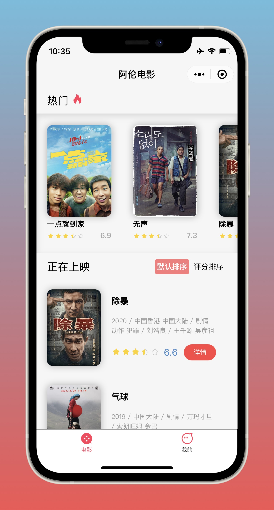
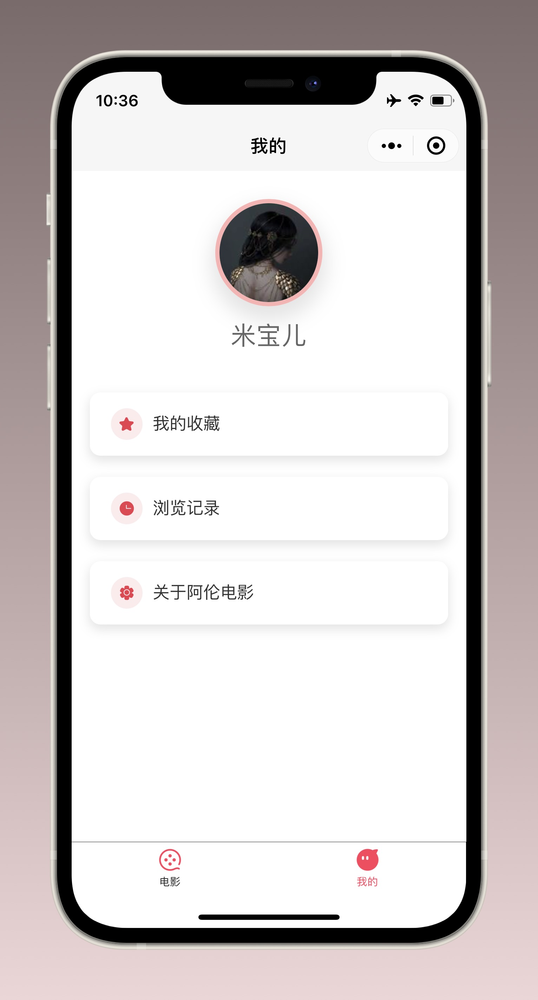
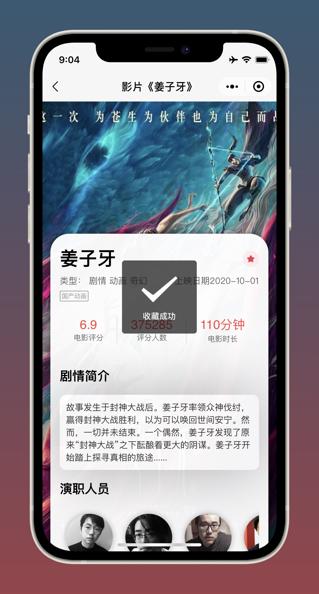
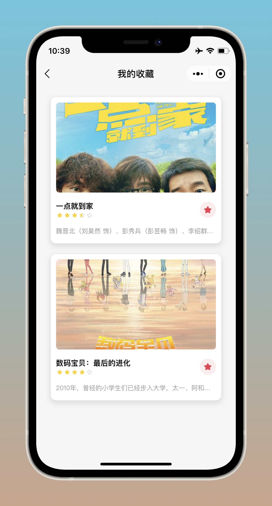

# Alun Movie

阿伦电影微信小程序，提供最新院线电影信息，帮你快速找到感兴趣的影片。

此项目不公开源代码，仅作为作品展示。

## 开发背景

十月的某天，当我想与电影院久别重逢时，打开了某电影购票软件
- 满减红包弹了出来
- 联合会员限时抢购弹了出来
- 影城卡促销弹了出来
- 水军刷的好评弹了出来
……

我只是想找一部感兴趣的影片，更希望看到关于影片本身的信息，而不是各种营销内容。既然不喜欢，那不妨自己写一个，于是就有了这个小程序。

## 体验版二维码

由于个人主体小程序无法正式发布（需要企业资质），故只能提供15个内测名额，如需体验请将微信号发送给我，添加进体验成员后即可使用

- 联系方式: <a href="mailto:letconst@icloud.com">letconst@icloud.com</a>

## 界面展示

  
  
  
  

> 页面布局已适配多种屏幕尺寸

## 相关功能
- __热门电影列表__
- __院线正映电影列表__
- __按评分排序__
- __豆瓣评分等详细信息__
  + 评分分数、评分人数
  + 影片类型、标签、放映时长
  + 剧情简介
  + 演职员表
  + 预告片（如果有的话）
  + 观众评论
  + 同类影片

- __收藏、浏览记录__
> 用户数据完全托管于微信小程序云开发官方数据库，截至目前不存储除“收藏列表”、“浏览记录”以外的任何数据，完全尊重用户个人隐私。

## 最后的碎碎念
阿伦电影的UI设计、代码实现（前端和后端）、更新维护均由我一人完成，这是我的第一个小程序作品，但不会是最后一个（下一个产品的构思、设计工作已经开始）。
我很享受创造的快乐，因为将想法变成现实很酷，也很让人满足。不管是WPA、微信小程序，还是移动端、桌面端应用，只要我产生了创作的想法就会想办法去实现它，通过项目实践来学习远远比书本或理论来得更扎实。

相比于HTML5，微信小程序有很多意料之外的坑，一个个踩过来感觉自己成长了不少，而我也借着云开发强大的功能熟悉了一些后端的逻辑，学无止境。

此项目暂时不会考虑开发iOS或Android版。
虽然用uni-app很快就能完成，但我创作它的初衷是“世界如此复杂 我们简单一点”，阿伦电影最好的归宿就是长期吃灰、偶尔使用。小程序才是它该扮演的角色：无需安装，用完即走。

## 作者

👤 **Jiang Menghao**

* Github: [@Jiangmenghao](https://github.com/Jiangmenghao)

---

## Show your support

Give a ⭐️ if this project helped you!